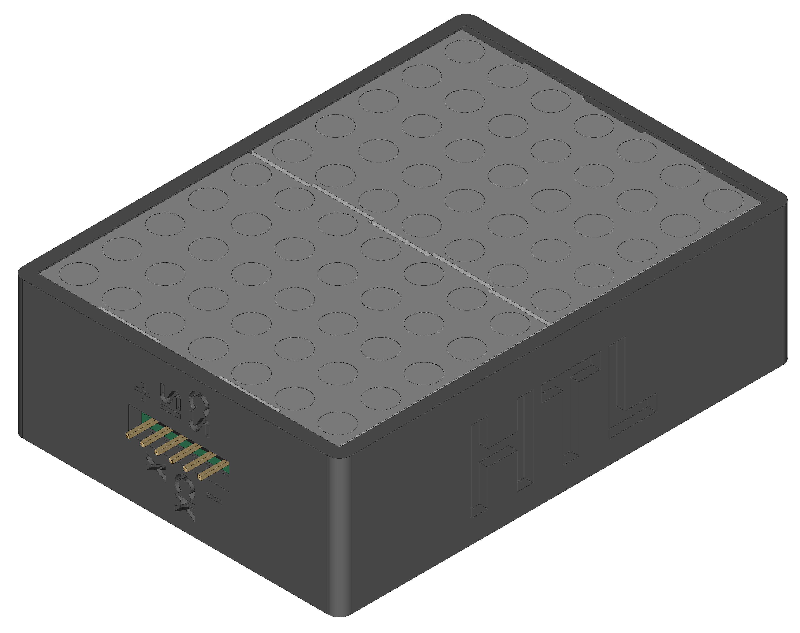
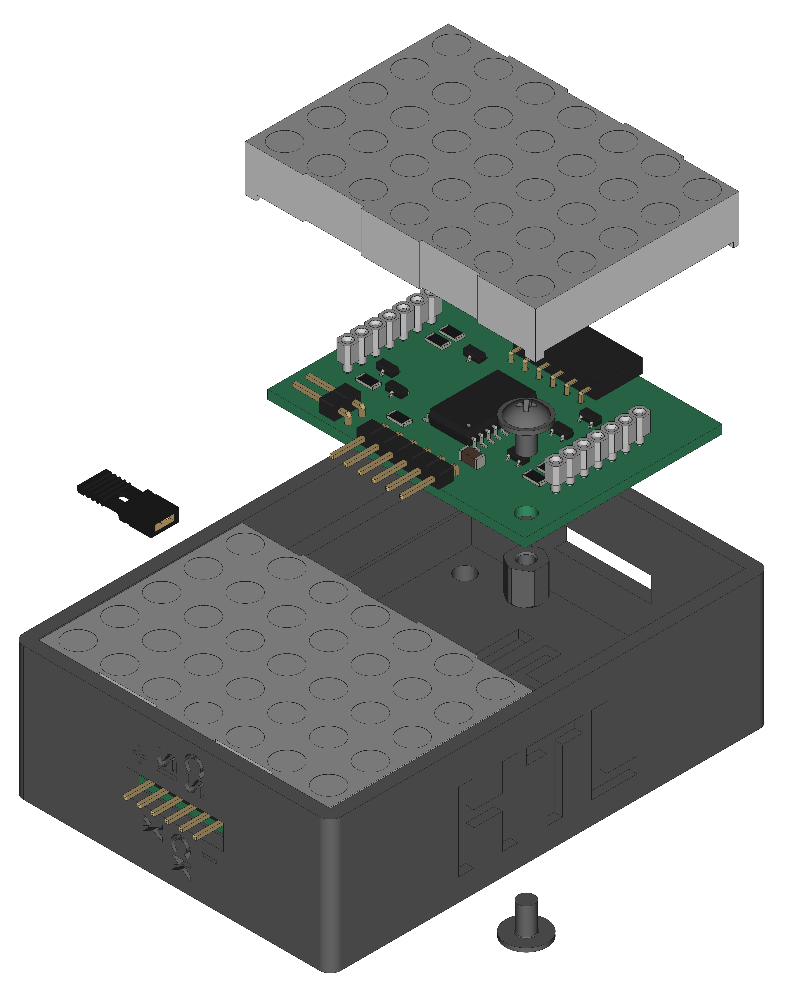
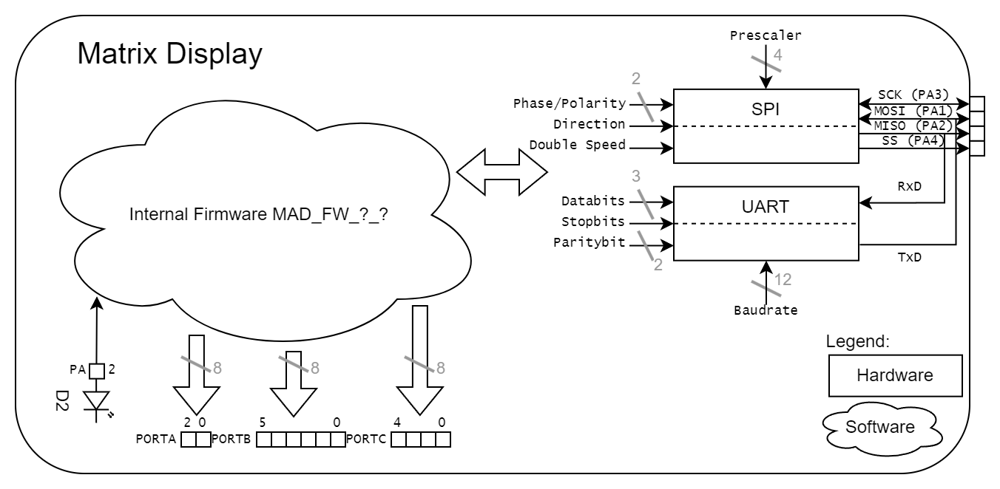

[](https://github.com/0x007e/mad)  [](https://creativecommons.org/licenses/by-nc-sa/4.0/legalcode)

# `MAD` - Matrix Display

The `MAD` project is based on a pcb with an [ATtiny406/ATtiny1606](#additional-information) and a [Matrix LED Display](#additional-information). It can be used to display data sent over `SPI` or `UART`. The display also implements a small amount of characters from the ASCII table and also has internal space (`EEPROM`) for 16 special characters that can be programmed.

| Experience | Level |
|:------------|:-----:|
| Soldering   |  |
| Mechanical  |  |
| Software    |  |

# Downloads

| Type      | File               | Description              |
|:---------:|:------------------:|:-------------------------|
| Schematic | [pdf](https://github.com/0x007E/mad/releases/latest/download/schematic.pdf) / [cadlab](https://cadlab.io/project/28600/main/files) | Schematic files |
| Board | [pdf](https://github.com/0x007E/mad/releases/latest/download/pcb.pdf) / [cadlab](https://cadlab.io/project/28600/main/files) | Board file |
| Drill | [pdf](https://github.com/0x007E/mad/releases/latest/download/drill.pdf) | Drill file |
| PCB | [zip](https://github.com/0x007E/mad/releases/latest/download/kicad.zip) / [tar](https://github.com/0x007E/mad/releases/latest/download/kicad.tar.gz) | KiCAD/Gerber/BoM/Drill files |
| Mechanical | [zip](https://github.com/0x007E/mad/releases/latest/download/freecad.zip) / [tar](https://github.com/0x007E/mad/releases/latest/download/freecad.tar.gz) | FreeCAD/Housing and PCB (STEP) files     |
| Firmware | [zip](https://github.com/0x007E/mad/releases/latest/download/firmware.zip) / [tar](https://github.com/0x007E/mad/releases/latest/download/firmware.tar.gz) | Firmware for ATtiny406/ATtiny1606 (Display) |
| Firmware (demo) | [zip](https://github.com/0x007E/mad/releases/latest/download/firmware-demo.zip) / [tar](https://github.com/0x007E/mad/releases/latest/download/firmware-demo.tar.gz) | Test application(s) for ATmega16a |

# Hardware

There are two parts of the hardware. The pcb and the housing of the `MAD`. The pcb is created with [KiCAD](#additional-information) and the housing with `FreeCAD`. The software is programmed with [Microchip (Atmel) Studio](#additional-information). All files are built with `github actions` so that they are ready for a production environment. The housing is printed with a 3D-printer (`Dremel 3D40`).

## PCB

The circuit board is populated on both sides (Top, Bottom). The best way for soldering the `SMD` components is within a vapor phase soldering system and for the `THT` components with a standard soldering system.

### Top Layer


### Bottom Layer


## Mechanical

The housing has a tolerance of `0.2mm` on each side of the case. So the pcb should fit perfectly in the housing. The tolerance can be modified with `FreeCAD` in the `Parameter` Spreadsheet.

### Assembled



#### Exploded



# Programming/Setup

The `MAD` is powerd with `5V` from an external source. With Jumper `JP1` bridged the `MAD` can be programmed over [UPDI](#additional-information). To enable `UART` mode the `SS (CS)` Pin must be held low (more details on the [dataflow](#dataflow-diagram) diagram) otherwise the `SPI` mode is enabled. In `UART` mode only one display can be driven. The `SI` pin gets `TXD`and the `SO` pin gets `RXD`. The firmware for the display can be downloaded (see the [download section](#downloads)).

``` bash
#         +-+                                         +----------+      +---------------------+
#        / /                                          |   U  +---+---+  |                     |
#      +-+-+-----------------+                        |   S  |  USB  |--+ +-----------------+ |
#      | JP1                 |                        |   B  +---+---+  | | AVR-Dude        | |
#      |    MAD - Display    |       +---------+      |   /      |      | | ~~~~~~~~        | |
#    +-+-+                 +-+-+   +-+-+  U    |      |   U      |      | | ~~~~~           | |
#    | 1 | VCC         VCC | 1 +---+VCC|  P  +-+-+  +-+-+ A      |      | | ~~~~~~~~~~~~    | |
#    | 2 | UPDI       UPDI | 2 +---+PDI|  D  |GND+--+GND| R      |      | |                 | |
#    | 3 | SI           SO | 3 |   +-+-+  I  |VCC+--+VCC| T      |      | +-----------------+ |
#    | 4 | SCK         SCK | 4 |     |       +---+  +---+ A      |      |                     |
#    | 5 | SS (CS)      SS | 5 +   +-+-+     |RxD+--+RxD| +------+      | Computer            |
#    | 6 | GND         GND | 6 +---+GND|     |TxD+--+TxD| |5V/3V3|      |                     |
#    +-+-+                 +-+-+   +-+-+     +-+-+  +-+-+ +------+      +---------------------+
#      +---------------------+     | ADAPTER |        +----+-----+
#                                  +---------+
```

## FUSES

| Register  | Value  |
|:---------:|:------:|
| `WDTCFG`  | `0x00` |
| `BODCFG`  | `0x00` |
| `OSCCFG`  | `0x02` |
| `TCD0CFG` | `0x00` |
| `SYSCFG0` | `0xF5` |
| `SYSCFG1` | `0x00` |
| `APPEND`  | `0x00` |
| `BOOTEND` | `0x00` |

> To setup `SW1` as `RESET` (`PA0`) it is necessary to change the `SYSCFG0`-FUSE of the `ATtiny406/ATtiny1606`. WARNING: To reset the `PA0` pin to `UPDI` mode a `12V` impulse is necessary to program the FUSES again.

# Software

The display software can be controlled by `SPI` or `UART`. The interfaces are displayed in the [dataflow](#dataflow-diagram) diagram. There is a demo software to use the display directly over `spi` (`MAD_Test`) or a `library` (`MAD_LIB`).

## Dataflow diagram



## UART Test

To send characters to the display over `UART` connect an USB/UART converter to the PC and make a bridge beween `GND` and `SS (CS)` before powering up the display. Start a terminal software on the computer (e.g. [Teraterm](#additional-information)) and setup the following settings:

| Name      | Value  |
|:---------:|:------:|
| PORT      | COM?   |
| BAUD      | 9600   |
| DATABITS  | 8      |
| PARITY    | NONE   |
| STOPBITS  | 1      |
| FLOWCTRL  | NONE   |

### Connection setup

``` bash

#      +---------------------+                                +---------------------+
#      |    MAD - Display    |                                |                     |
#    +-+-+                 +-+-+                              | +-----------------+ |
#    | 1 | VCC         VCC | 1 +-------+    +----------+      | | TeraTerm        | |
#    | 2 | UPDI       UPDI | 2 |       |    |   U  +---+---+  | | ~~~~~~~~        | |
#    | 3 | SI           SO | 3 +-----+ |    |   S  |  USB  |--+ | ~~~~~           | |
#    | 4 | SCK         SCK | 4 |     | |    |   B  +---+---+  | | ~~~~~~~~~~~~    | |
#    | 5 | SS (CS)      SS | 5 +--+  | |    |   /      |      | |                 | |
# +--+ 6 | GND         GND | 6 +--+  | |    |   U      |      | +-----------------+ |
# |  +-+-+                 +-+-+     | |  +-+-+ A      |      |                     |
# |    +---------------------+       | +--+VCC| R      |      | Computer            |
# |                                  +----+TxD| T      |      |                     |
# |                                       |RxD| +------+      +---------------------+
# +---------------------------------------+GND| |5V/3V3|
#                                         +-+-+ +------+
#                                           +----+-----+
```

## SPI Test

The `firmware` itself contains some demos how to use the display over `spi`. The demo software itself is written for an [ATmega16A](#additional-information). To test the display a connection to the `spi` pins between the display and the [ATmega16A](#additional-information)is necessary.

### Connection setup

``` bash
# ~------------+
# ~          +-+-+
# ~          |VCC+------+
# ~          +-+-+       \        +---------------------+
# ~            |          \       |     MAD - Display   |
# ~  A       +-+-+         \    +-+-+                 +-+-+
# ~  T   [7] | P +- SCK -+  +---+ 1 | VCC         VCC | 1 |
# ~  M       | O |        \     | 2 | UPDI       UPDI | 2 |
# ~  E       | R +- MOSI --\----+ 3 | SI           SO | 3 |
# ~  G       | T +-- SS -+  +---+ 4 | SCK         SCK | 4 |
# ~  A       | B |       +------+ 5 | SS (CS)      SS | 5 |
# ~          |   |           +--+ 6 | GND         GND | 6 |
# ~  1       |   |          /   +-+-+                 +-+-+
# ~  6   [0] |   |         /      |                     |
# ~  A       +-+-+        /       +---------------------+
# ~            |         /
# ~          +-+-+      /
# ~          |GND+-----+
# ~          +-+-+
# ~~~~~~~~~~~~~~ 
```

### SPI Parameter

To control the display through `SPI` the bus of the master needs the following setup:

| Parameter | Value   | Description |
|:----------|:-------:|:------------|
| Clock     | < 1Mhz  | Bus clock speed should not exceed this value |
| Direction | MSB     | MSB needs to be transmitted first |
| Polarity  | Rising  | Polarity of clock is rising `_/` |
| Phase     | Rising  | Data is valid when clock is rising `_/` |

> Detail can be found [here](https://de.wikipedia.org/wiki/Serial_Peripheral_Interface)

### SPI Frame

``` bash

# SPI display transmission
# _                                                SS                                                _
#  \________________________________________________________________________________________________/
#                                                 SCK   
#     __    __    __    __    __    __    __    __    __    __    __    __    __    __    __    __    
# ___/1 \__/2 \__/3 \__/4 \__/5 \__/6 \__/7 \__/8 \__/9 \__/10\__/11\__/12\__/13\__/14\__/15\__/16\___
#                                                 MOSI
#    __    __    __    __    __    __    __    __    __    __    __    __    __    __    __    __
# __/C \__/T \__/R \__/L \__/B \__/Y \__/T \__/E \__/D \__/A \__/T \__/A \__/B \__/Y \__/T \__/E \____
#   \__/  \__/  \__/  \__/  \__/  \__/  \__/  \__/  \__/  \__/  \__/  \__/  \__/  \__/  \__/  \__/
#    [7                   :                    0]    [7                   :                    0]
```

### SPI Commands

To enable a bit it needs to be set to on ($1=ON$). To disable a bit it is necessary to set it to off ($0=OFF$).

| Control-Byte | Data-Bit(s)| Description    |
|:------------:|:----------:|:---------------|
| `0x00`       | `0xXX`     | No operation   | 
| `0x01`       | `[4:0]`    | ROW1 LEDs | 
| ...          | ...        | ... | 
| `0x07`       | `[4:0]`    | ROW7 LEDs | 
| `0x08`       | `[6:0]`    | Show ASCII character on display |
| `0x10`       | `0xXX`    | Clear buffer |
| `0x1F`       | `[0]`      | Enable display |
| `0x20`       | `0xXX`     | Copy EEPROM address (0) to display |
| ...          | ...        | ... | 
| `0x2F`       | `0xXX`     | Copy EEPROM address (15) to display |
| `0x30`       | `0xXX`     | Copy Display content to EEPROM address (0) |
| ...          | ...        | ... | 
| `0x3F`       | `0xXX`     | Copy Display content to EEPROM address (15) |
| `0xF0`       | `0xXX`     | Display refresh rate LOW byte |
| `0xF1`       | `0xXX`     | Display refresh rate HIGH byte |
| `0xFF`       | `0xXX`     | RESET the SPI queue |

### Example Library (`matrix.h`)

With the attached demo library (`MAD_LIB`) it is quiet easy to use the display. To setup the matrix display library some `defines` needs to be adjusted.

``` c
// Setup the number of displays that are cascaded
#ifndef MATRIX_DISPLAYS
    #define MATRIX_DISPLAYS 2
#endif
```

``` c
#include "../lib/matrix/matrix.h"

int main(void)
{
    matrix_init();
    matrix_reset();
    _delay_ms(MATRIX_RESET_RECOVERY_TIME_MS);
    matrix_enable();

    matrix_char(1, 'A');
    _delay_ms(1000);
    matrix_char(2, 'B');

    matrix_frame(buffer);
    // ...
}
```

# Additional Information

| Type       | Link               | Description              |
|:----------:|:------------------:|:-------------------------|
| ATtiny406  | [pdf](https://ww1.microchip.com/downloads/en/DeviceDoc/Microchip%208bit%20mcu%20AVR%20ATtiny406%20data%20sheet%2040001976A.pdf) | ATtiny microcontroller |
| ATtiny1606 | [pdf](http://ww1.microchip.com/downloads/en/DeviceDoc/ATtiny806_1606_Data_Sheet_40002029A.pdf) | ATtiny microcontroller |
| ATmega16A | [pdf](https://ww1.microchip.com/downloads/en/devicedoc/atmel-8154-8-bit-avr-atmega16a_datasheet.pdf) | Microchip ATmega16A Datasheet |
| TA20-11SRWA | [pdf](https://www.kingbrightusa.com/images/catalog/spec/ta20-11srwa.pdf) | Dot Matrix Dispaly |
| Atmel ICE | [pdf](https://ww1.microchip.com/downloads/en/DeviceDoc/Atmel-ICE_UserGuide.pdf) | Atmel ICE datasheet |
| UPDI | [web](https://github.com/0x007e/updi) | UPDI-Adapter with AVR-Dude |
| Microchip Studio | [web](https://www.microchip.com/en-us/tools-resources/develop/microchip-studio) | Download page for Microchip Studio |
| KiCAD | [web](https://www.kicad.org/) | KiCAD project page |
| FreeCAD | [web](https://www.freecad.org/) | FreeCAD project page |
| TeraTerm | [web](https://github.com/TeraTermProject/teraterm/releases/download/v5.3/teraterm-5.3.zip) | Terminal software for UART |

---

R. GAECHTER
